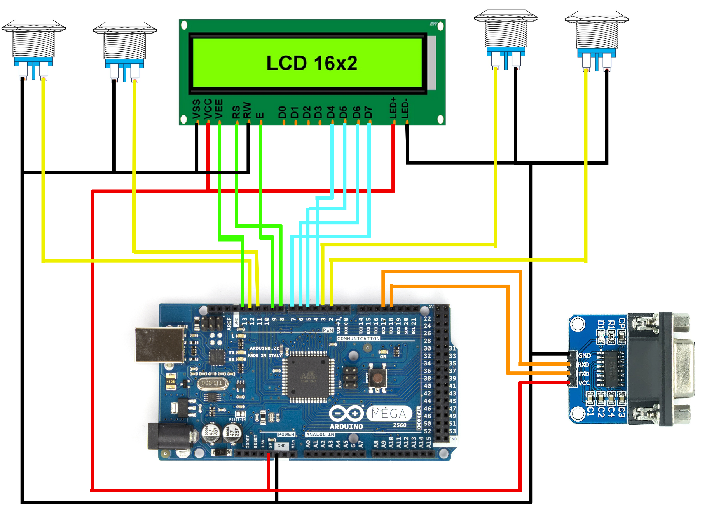

# treadmill-controller

Repository for everything related to the (large) treadmill controller and the development of a replacement.

There is now a treadmill controller (V1.1!), seen in src/main.cpp, for the Arduino MEGA 2560. This code is made using the [PlatformIO](https://platformio.org/) extension in [VSCode](https://code.visualstudio.com/), but if you're using Arduino IDE, you can still copy this code (and comment out `#include <Arduino.h>`) and insert it into your IDE. This code is loosely based on the code of this [BEP-project (Google Drive)](https://drive.google.com/drive/folders/1Ybq1MYfMuqriUXR8rnFI0I6cMbTBkTJx?usp=drive_link), in the sense that we also write over serial1, and we used their lookup-table for the speed controls to the treadmill. The code now also has a serialmonitor if you connect a pc, and an lcd for all this info if you're not connected to a pc. We suspect this won't generate problems if there's no computer connected to the Arduino.

For setup: the treadmill's controller (the white one) is still used here, its controls are being bypassed by the arduino code in this repository.

## Connections
Currently, we use an [Arduino Sensor Shield V5.0](https://www.hobbyelectronica.nl/en/product/sensor-shield/) for (almost) all the connections. The only connection not on this board is the serial conection to the treadmill ([RS232-TTL](https://www.benselectronics.nl/rs232-ttl-converter.html)). The connections are shown below

